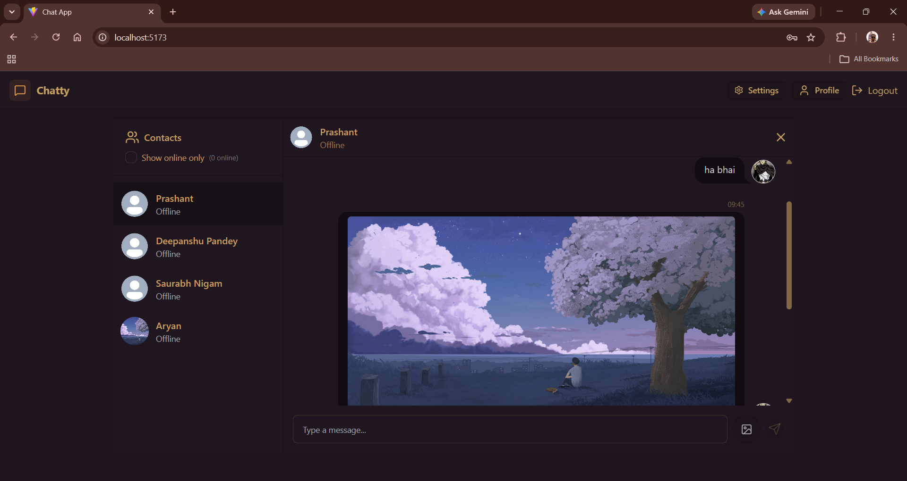
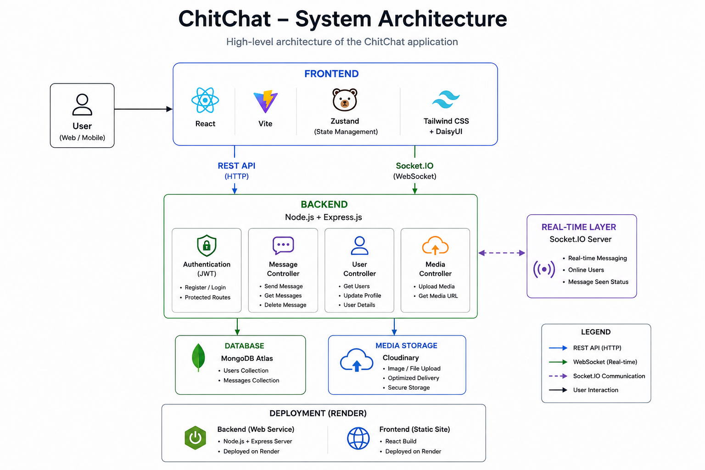
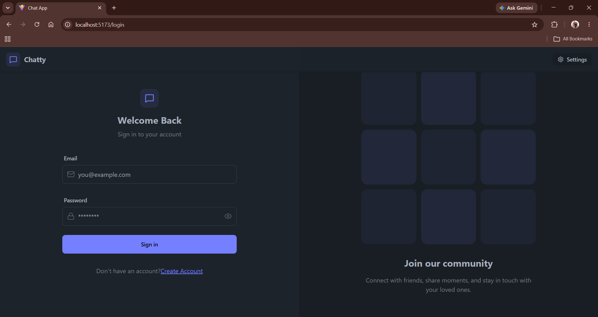
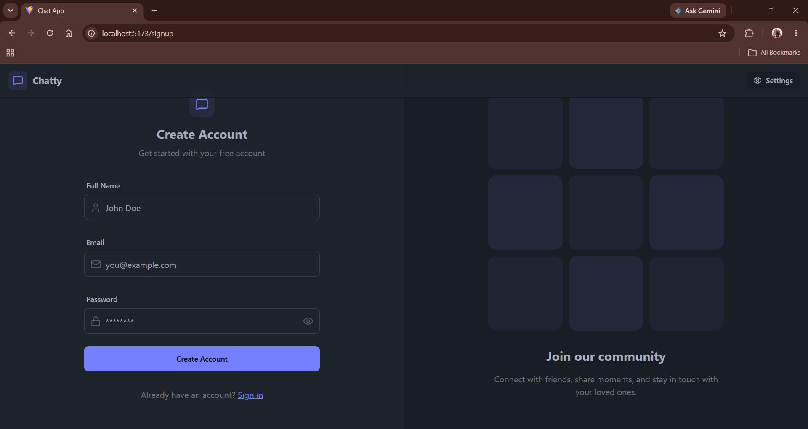
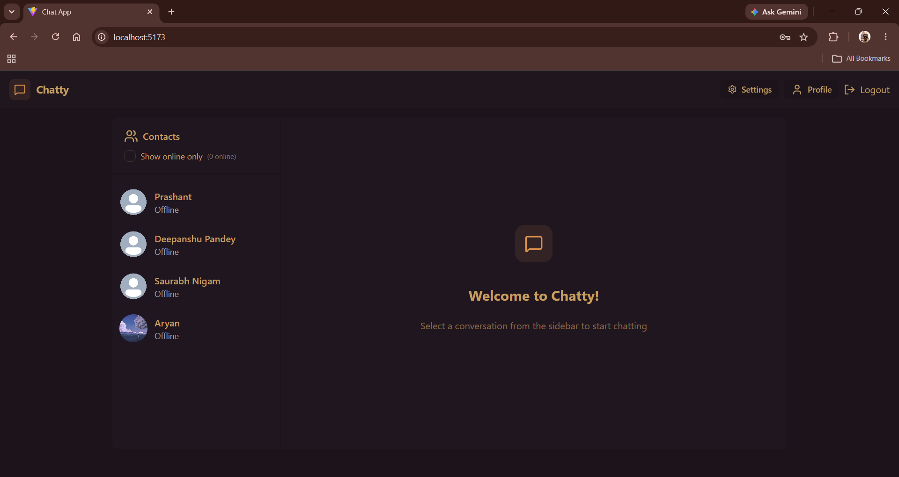
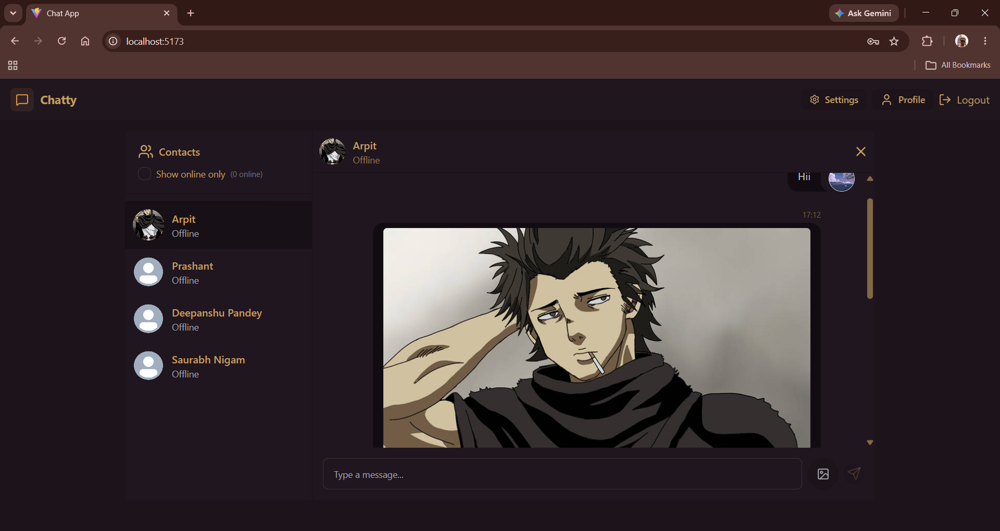
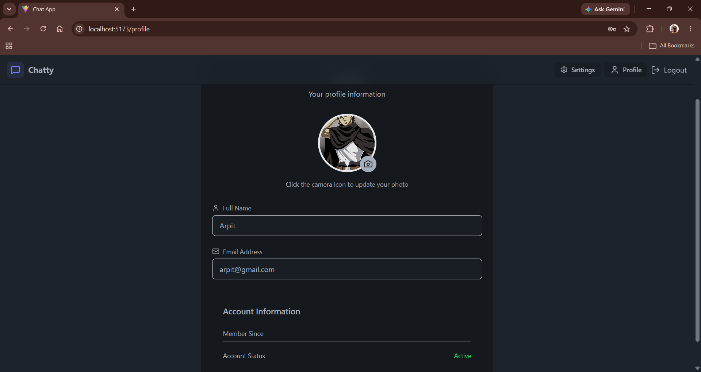
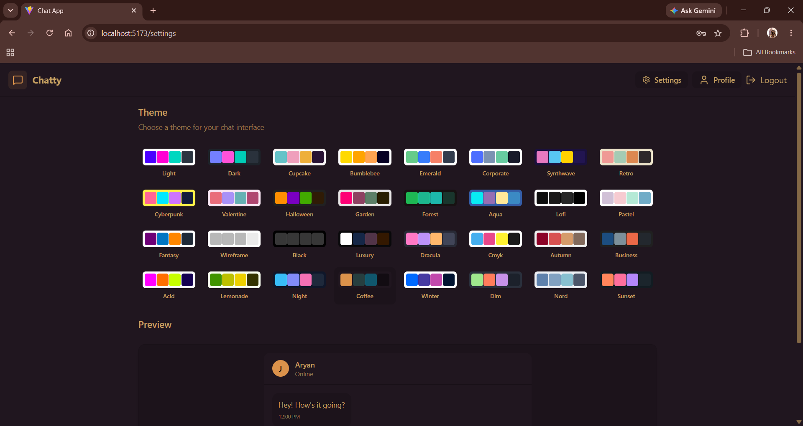

<div align="center">

# 💬 ChitChat

### Real-Time MERN Chat Application

A full-stack chat application built with the **MERN Stack** that enables secure real-time one-to-one messaging, image sharing, customizable themes, and user authentication.

<p>

<a href="https://chit-chat-ddkk.onrender.com">

</a>

<a href="https://github.com/arpit571/ChitChat">

</a>

<a href="https://www.linkedin.com/in/arpit-upadhyay-dev/">

</a>

</p>

<p>


</p>

</div>

---

## 📖 Overview

**ChitChat** is a full-stack **MERN** chat application that allows users to communicate in real time through secure one-to-one messaging. It combines **JWT Authentication**, **Socket.IO**, **MongoDB**, and **Cloudinary** to provide a modern chat experience with instant messaging, image sharing, customizable themes, and profile management.

The project was built to strengthen practical full-stack development skills by implementing real-world concepts such as authentication, WebSocket communication, REST APIs, media uploads, state management, and deployment.

Rather than focusing only on features, this project also involved debugging production issues, improving deployment, fixing persistent profile updates, restoring theme compatibility, and refining the overall project structure.

---

# 🌐 Live Demo

| Application | Link |
|-------------|------|
| 🚀 Live Website | https://chit-chat-ddkk.onrender.com |
| 📂 GitHub Repository | https://github.com/arpit571/ChitChat |

---

# 📸 Project Preview

<p align="center">



</p>

> **Note**
>
> The screenshot above demonstrates the primary chat interface including the conversation panel, online users, image sharing support, and responsive layout.

---

# ✨ Highlights

- 🔐 Secure JWT Authentication
- 💬 Real-Time Messaging with Socket.IO
- 🖼️ Image Sharing using Cloudinary
- 👤 Profile Picture Upload
- 👀 Message Seen Status
- 🎨 Multiple DaisyUI Themes
- 📱 Responsive User Interface
- ⚡ Fast React + Vite Frontend
- ☁️ Full Deployment on Render

---

# ✨ Features

## 🔐 Authentication

- Secure user registration and login
- JWT-based authentication
- Protected application routes
- Persistent user sessions using HTTP-only cookies
- Secure logout functionality

---

## 💬 Real-Time Messaging

- One-to-one real-time messaging
- Instant message delivery using Socket.IO
- Online user presence
- Message seen status
- Responsive chat interface

---

## 🖼️ Media Sharing

- Upload and send images during conversations
- Cloudinary integration for media storage
- Persistent profile picture updates

---

## 👤 User Profile

- Update profile picture
- View account information
- Persistent profile data across sessions

---

## 🎨 User Experience

- Multiple DaisyUI themes
- Theme preference persistence
- Responsive layout for different screen sizes
- Toast notifications
- Loading indicators

---

## 🛡️ Security

- Password hashing using bcrypt
- JWT Authentication
- Helmet security middleware
- Basic API rate limiting
- Protected backend routes

---

# 🛠 Tech Stack

| Category | Technologies |
|----------|--------------|
| Frontend | React, Vite, Tailwind CSS, DaisyUI |
| State Management | Zustand |
| Backend | Node.js, Express.js |
| Database | MongoDB, Mongoose |
| Authentication | JWT, bcryptjs, Cookie Parser |
| Real-Time Communication | Socket.IO |
| Image Storage | Cloudinary |
| API Testing | REST APIs |
| Deployment | Render |

---

# 🏗️ System Architecture

<p align="center">



</p>

### Application Flow

```text
User
      │
      ▼
React + Vite Frontend
      │
Axios + Socket.IO Client
      │
      ▼
Express.js Backend
      │
 ┌────┼───────────────┐
 │    │               │
 │    │               │
JWT  Socket.IO   Cloudinary
 │    │               │
 └────┼───────────────┘
      │
      ▼
MongoDB
```

The frontend communicates with the backend through REST APIs for authentication and profile management, while Socket.IO enables real-time communication between connected users. User data and chat history are stored in MongoDB, and images are uploaded to Cloudinary before being shared in conversations.

---

# 📂 Project Structure

```text
ChitChat
│
├── backend
│   ├── src
│   │   ├── controllers
│   │   ├── middleware
│   │   ├── models
│   │   ├── routes
│   │   ├── lib
│   │   ├── seeds
│   │   └── index.js
│   │
│   ├── package.json
│   └── .env
│
├── frontend
│   ├── public
│   ├── src
│   │   ├── components
│   │   ├── constants
│   │   ├── lib
│   │   ├── pages
│   │   ├── store
│   │   ├── App.jsx
│   │   └── main.jsx
│   │
│   ├── package.json
│   └── .env
│
├── screenshots
│
├── LICENSE
├── .env.example
└── README.md
```

---

# 📌 Core Functionality

| Feature | Status |
|---------|:------:|
| User Authentication | ✅ |
| Real-Time Messaging | ✅ |
| Image Sharing | ✅ |
| Online User Status | ✅ |
| Message Seen Status | ✅ |
| Profile Picture Upload | ✅ |
| Theme Switching | ✅ |
| Responsive Design | ✅ |
| Render Deployment | ✅ |

---

# 🚀 Getting Started

Follow these steps to set up ChitChat locally.

---

## 1️⃣ Clone the Repository

```bash
git clone https://github.com/arpit571/ChitChat.git

cd ChitChat
```

---

## 2️⃣ Backend Setup

Navigate to the backend folder.

```bash
cd backend
npm install
```

Create a `.env` file using the provided `.env.example`.

Start the backend server.

```bash
npm run dev
```

The backend will start on:

```text
http://localhost:5001
```

---

## 3️⃣ Frontend Setup

Open a new terminal.

```bash
cd frontend
npm install
npm run dev
```

The frontend will be available at:

```text
http://localhost:5173
```

---

# ⚙️ Environment Variables

Create a `.env` file in the project root (or follow your project structure) using the provided `.env.example`.

| Variable | Description |
|----------|-------------|
| PORT | Backend server port |
| NODE_ENV | Application environment |
| MONGODB_URI | MongoDB connection string |
| JWT_SECRET | Secret key used for JWT authentication |
| CLOUDINARY_CLOUD_NAME | Cloudinary cloud name |
| CLOUDINARY_API_KEY | Cloudinary API key |
| CLOUDINARY_API_SECRET | Cloudinary API secret |
| VITE_API_URL | Backend API URL used by the frontend |

> The repository includes an `.env.example` file to simplify local setup.

---

# 📸 Application Screenshots

## Authentication

| Login | Sign Up |
|--------|----------|
|  |  |

---

## Chat Interface

<p align="center">



</p>

---

## Image Sharing

<p align="center">



</p>

---

## User Profile

<p align="center">



</p>

---

## Theme Customization

<p align="center">



</p>

---

# 🧩 Challenges & Improvements

Developing ChitChat involved more than implementing features. During development and deployment, several issues were identified and resolved to improve the overall stability and user experience.

### Improvements made during development

- Fixed profile picture persistence after page refresh.
- Added support for message seen status.
- Restored DaisyUI theme compatibility after dependency migration.
- Improved deployment configuration and environment management.
- Enhanced project documentation and repository organization.
- Refined authentication flow and deployment stability.

These improvements helped make the application more reliable and easier to maintain.

---

# 📚 What I Learned

Building ChitChat helped me gain practical experience in:

- Designing and building a full-stack MERN application.
- Implementing JWT-based authentication.
- Using Socket.IO for real-time communication.
- Managing global state using Zustand.
- Uploading and serving media with Cloudinary.
- Working with MongoDB and Mongoose.
- Structuring REST APIs using Express.js.
- Applying middleware for authentication and security.
- Debugging production deployment issues.
- Managing environment variables for frontend and backend.
- Improving project structure and GitHub documentation.

---

# 💡 Key Takeaways

Through this project, I strengthened my understanding of:

- Authentication workflows
- Client-server communication
- WebSocket fundamentals
- REST API development
- Image upload pipelines
- State management in React
- Deployment and production debugging
- Repository organization and documentation

---

# 🚀 Future Improvements

ChitChat currently focuses on secure one-to-one real-time messaging. In the future, I plan to expand the project with additional features while keeping the codebase clean and maintainable.

Some planned improvements include:

- 👥 Group Conversations
- ⌨️ Typing Indicators
- 😊 Emoji Reactions
- 🔍 Message Search
- 📎 File & Document Sharing
- 🔔 Push Notifications
- 📱 Enhanced Mobile Experience
- 🟢 Better Presence & Activity Status
- 💬 Reply to Specific Messages
- ⭐ Message Pinning

---

# 🤝 Contributing

Contributions, suggestions, and feedback are always welcome.

If you find a bug or have an idea for an improvement, feel free to open an Issue or submit a Pull Request.

---

# 👨‍💻 About the Developer

Hi, I'm **Arpit Upadhyay**.

I'm a Computer Science student passionate about Full-Stack Development, Backend Engineering, Cloud Computing, and building practical software projects that solve real-world problems.

ChitChat was developed from scratch as a learning project to gain hands-on experience with modern web technologies, real-time communication, authentication, media handling, deployment, and software engineering best practices.

### Connect with me

- GitHub: https://github.com/arpit571
- LinkedIn: https://www.linkedin.com/in/arpit-upadhyay-dev/

---

# 🙏 Acknowledgements

This project was built as a personal learning project.

Throughout development, I referred to official documentation and educational resources whenever I encountered new concepts or implementation challenges. Those resources helped me understand the technologies while ensuring the project remained my own implementation.

Some of the technologies used include:

- React
- Express.js
- MongoDB
- Socket.IO
- Cloudinary
- Tailwind CSS
- DaisyUI

---

# 📄 License

This project is licensed under the **MIT License**.

See the [LICENSE](LICENSE) file for more details.

---

<div align="center">

### ⭐ If you found this project helpful, consider giving it a star!

Thank you for taking the time to explore ChitChat.

</div>
